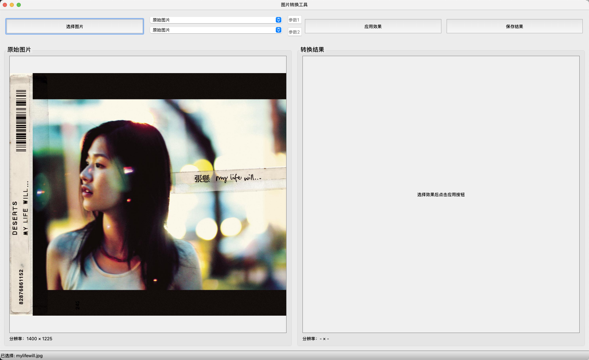

# DIP‑PixMorph 🎨

A digital image processing toolkit with traditional filters, neural style transfer, and pixel art effects. 
一个集传统滤波器、神经风格迁移与像素艺术效果于一体的数字图像处理工具包
##  Features

- 基本图像处理：滤波、阈值、变换、边缘检测等
    
- **风格迁移**（Style Transfer）：支持多种预训练模型，如 Candy、Mosaic、Udnie、Rain Princess、自训练模型
    
- **像素艺术生成**：多种预设风格（pixel、retro、manga、cartoon、realistic 等），可用于生成**拼豆图纸**或低像素风格图像。
    

---

## 🛠️ 安装与依赖

```bash
git clone https://github.com/nisikin/DIP-PixMorph.git
cd DIP-PixMorph
python3 -m venv venv
source venv/bin/activate   # Windows: venv\Scripts\activate
pip install -r requirements.txt
```

确保你的 Python 是 3.8+，并且成功安装以下依赖：

- torch, torchvision
    
- pillow, opencv-python
    
- numpy
    
- pyqt5（如果你使用 GUI ）
    

---

## 🚀 使用

### 命令行演示

```bash
python app.py
```

打开 PyQt GUI，选择图像、选择效果（如 “pixel”, “manga”, “retro”, “rain_princess” 等），点击“应用”，即可查看结果并保存。



### 程序接口


---

## 🎨 Pixel Style 风格预设

预设包括：

```python
PIXEL_STYLE_PRESETS = {
  "pixel": {"kernel_size":10,"pixel_size":16,"edge_thresh":100},
  "retro": {"kernel_size":8,"pixel_size":24,"edge_thresh":80},
  "manga": {"kernel_size":5,"pixel_size":12,"edge_thresh":60},
  "cartoon":{"kernel_size":12,"pixel_size":20,"edge_thresh":100},
  "realistic":{"kernel_size":2,"pixel_size":10,"edge_thresh":50},
  "vintage":{"kernel_size":6,"pixel_size":18,"edge_thresh":70},
  "sketch":{"kernel_size":3,"pixel_size":8,"edge_thresh":120},
  "blocky":{"kernel_size":15,"pixel_size":30,"edge_thresh":90},
  "anime":{"kernel_size":4,"pixel_size":14,"edge_thresh":130},
  "soft":{"kernel_size":20,"pixel_size":16,"edge_thresh":40},
  "noir":{"kernel_size":5,"pixel_size":12,"edge_thresh":150},
}
```

在 GUI 下拉框中选择这些效果，就会自动应用对应参数。


---

## 📚 参考资料

- 类似项目参考：    


---

## ✅ 贡献方式

欢迎你提交 Pull Request、报告 Issue，或加入讨论优化功能！建议分支为 `feature/xxx`，合并前需通过 CI 或 local 测试。

---

## 📄 License

This project is licensed under the [MIT License](LICENSE).
详见本仓库自带 `LICENSE` 文件。

---
