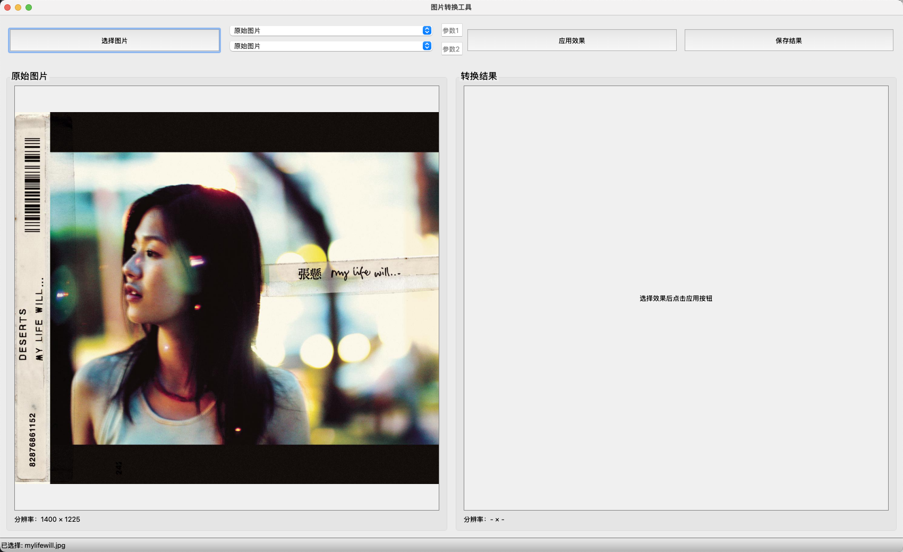
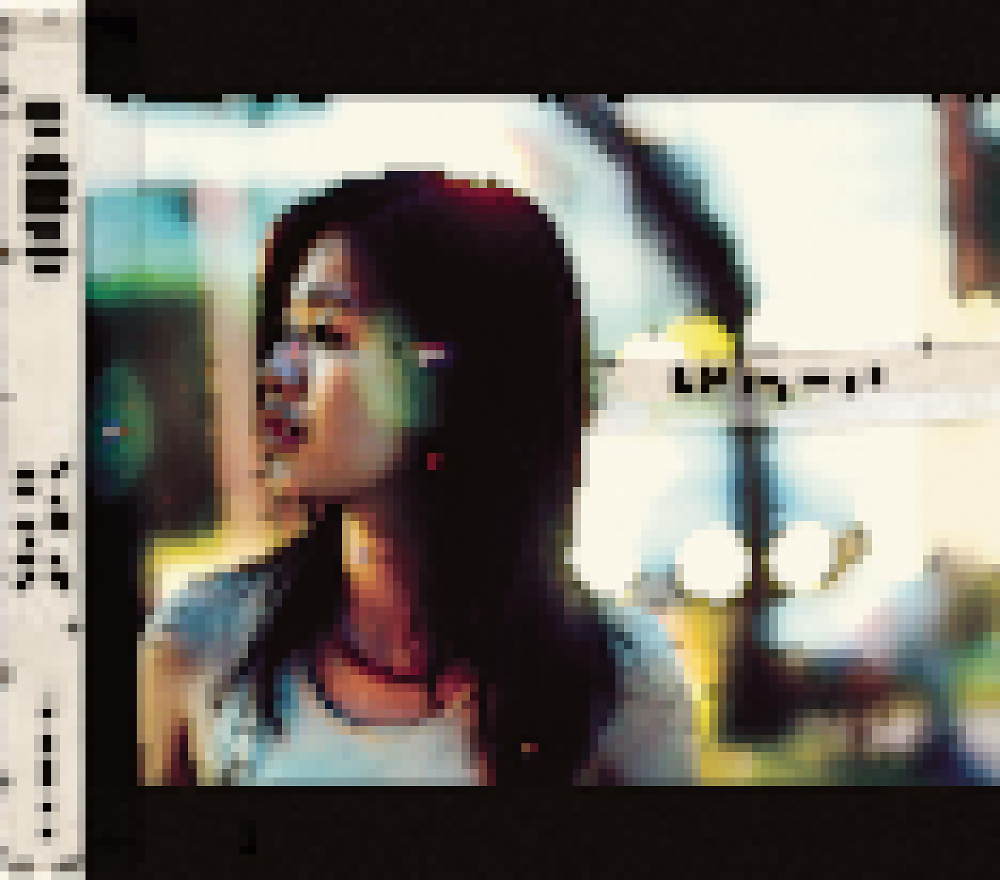
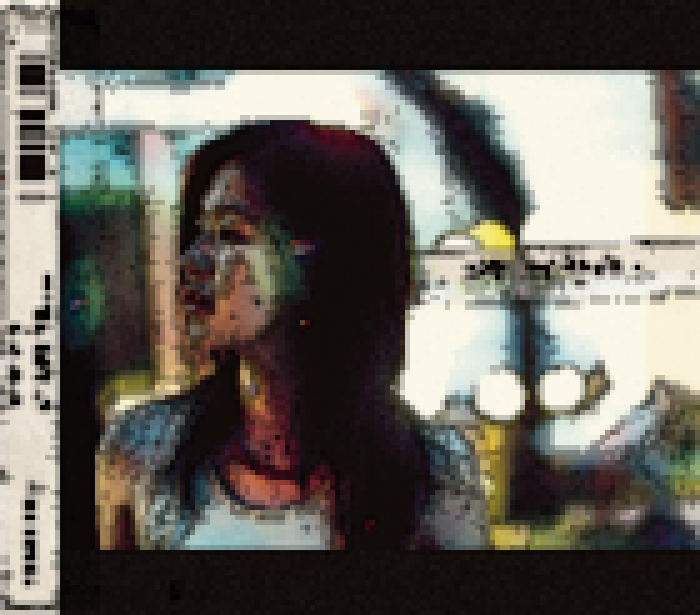
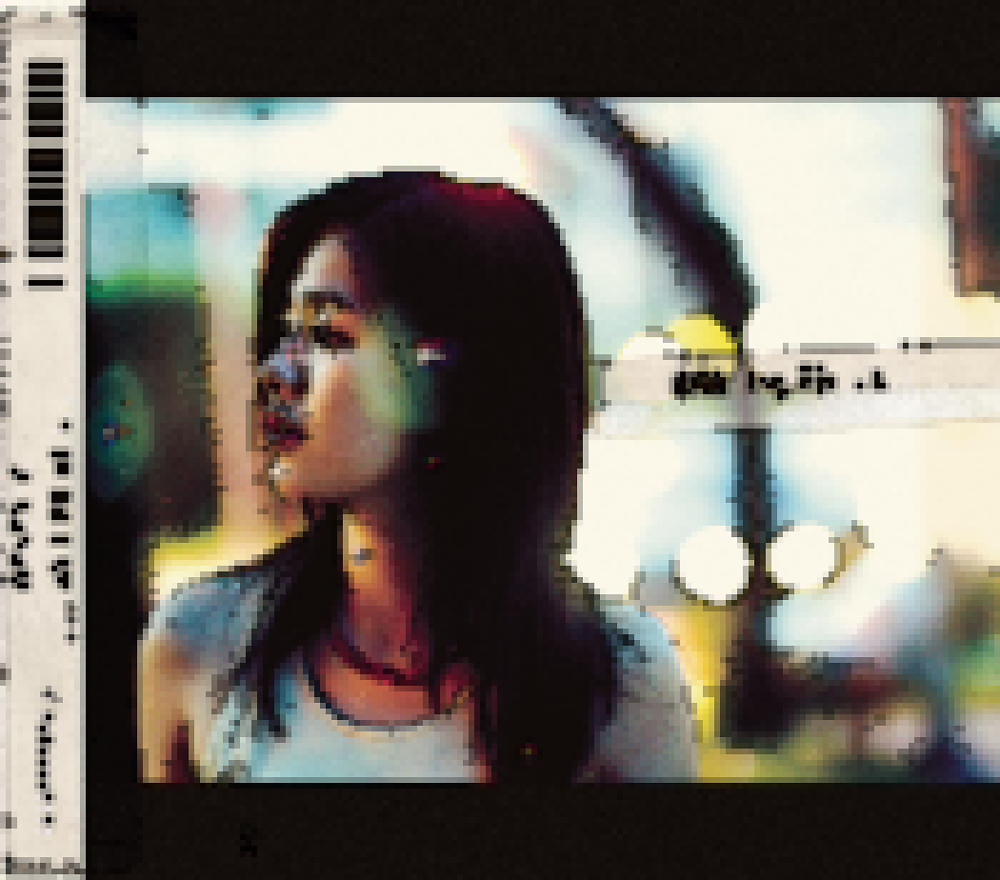

#  DIP‑PixMorph

A comprehensive digital image processing toolkit with neural style transfer and multiple pixel art effect presets.<br>
一个集丰富且完善的传统数字图像处理功能（包括滤波、阈值处理、边缘检测、形态学操作、几何变换、直方图处理及噪声添加）与神经风格迁移、多种像素艺术风格预设于一体的综合工具包。

##  Features

- 基本图像处理：滤波、阈值、变换、边缘检测等
    
- **风格迁移**（Style Transfer）：支持多种预训练模型，如 Candy、Mosaic、Udnie、Rain Princess、自训练模型
    
- **像素艺术生成**：多种预设风格（pixel、retro、manga、cartoon、realistic 等），可用于生成**拼豆图纸**或低像素风格图像。
    

---
## 📦 项目结构
```
DIP-PixMorph/
├── assets/                  # 静态资源
├── src/                     # 源代码
│   ├── basic/               # 基础图像处理
│   ├── pixel/               # 像素风格转换
│   │   ├──utils/            # 像素模块的工具及模组
│   │   └──convert.py        # 像素风格转换核心代码
│   └── style_transfer/      # 艺术风格迁移
│       ├──models            # 预训练模型文件
│       ├──netural_style     # 神经风格迁移核心实现代码
│       └──scripts           # 训练和推理辅助脚本
├── test/                    # 测试文件
├── .gitignore               # Git忽略配置
├── app.py                   # 主程序入口
├── LICENSE                  # 许可证文件
├── README.md                # 项目说明文档
└── requirements.txt         # 依赖包列表
```
## 🛠️ 安装与依赖

```bash
git clone https://github.com/nisikin/DIP-PixMorph.git
cd DIP-PixMorph
python3 -m venv venv
source venv/bin/activate   # Windows: venv\Scripts\activate
pip install -r requirements.txt
```

确保你的 Python 是 3.8+，并且成功安装以下依赖：

- torch, torchvision（用于神经风格迁移与模型推理）

- Pillow, opencv-python（图像处理基础）

- numpy, scipy（矩阵运算与图像变换）

- PyQt5（仅在使用图形界面 GUI 时需要）

---

## 🚀 使用

### 命令行演示

```bash
python app.py
```

打开 PyQt GUI，选择图像、选择效果（如 “pixel”, “manga”, “retro”, “rain_princess” 等），点击“应用”，即可查看结果并保存。



### 程序接口


---
## 🖼️ 风格迁移
本项目集成了 Torch 实现的神经风格迁移，可一键将照片转换为特定画风。预设模型如下：

| 模型名称            | 风格示意图        |
|-----------------|--------------|
| `Candy`         | 糖果般的明亮斑斓风格   |
| `Mosaic`        | 色块拼接感强的现代风格  |
| `Udnie`         | 抽象表现主义风格     |
| `Rain Princess` | 雨中夜景般的浪漫油画风  |
| `our_trained`   | 我们训练的自定义风格模型 |

使用方式：在 GUI 中选择对应风格，点击“应用”即可预览与保存转换结果。

---
## 🎨 Pixel Style 

预设包括：


|                 Pixel                 |                   Realistic                   |                 Sketch                  |
|:-------------------------------------:|:---------------------------------------------:|:---------------------------------------:|
|  |  |  |
|                  ...                  |                      ...                      |                   ...                   |

也可通过预留的程序接口自行调整风格

---

## 📚 参考资料

- 类似项目参考：https://github.com/pytorch/examples/tree/main/fast_neural_style

---

## 📄 License

This project is licensed under the [MIT License](LICENSE).

---
